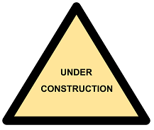

Welcome to the Web hosting site for the Doane Center for Computing in the Liberal Arts
(CCLA) High-Performance Computing (HPC) workshop. This workshop is designed for 
students and researchers, who have some programming experience, and who want to 
decrease the amount of time their code takes to run. 

We assume that you have some experience with Python, and will include some examples
in C++ as well. 

The sections below provide direct links to the various lessons hosted here. New blog posts 
will be posted as more content is added to the site. 

## How make your Python code run faster

1. [Optimizing Python code overview](./pages/optimizing-python-overview/index.html)
2. [Using built-in functions](../pages/optimizing-python-built-ins/index.html)
3. [List comprehension](../pages/optimizing-python-list-comprehension/index.html)
4. [Using aliases](../pages/optimizing-python-function-alias/index.html)
5. [Aggregate functions](../pages/optimizing-python-function-aggregate/index.html)

## How to utilize automatic multi-core parallelism using OpenMP

## How to begin to write distributed parallel code to run on supercomputers, using OpenMPI

# Blog posts
